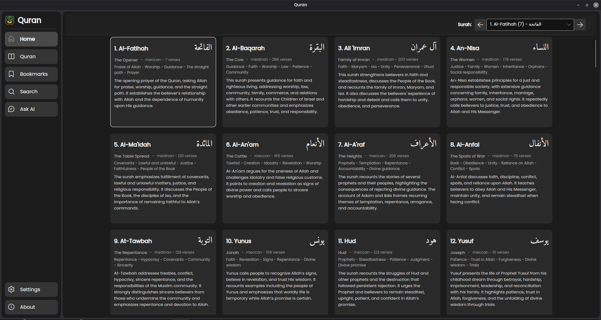
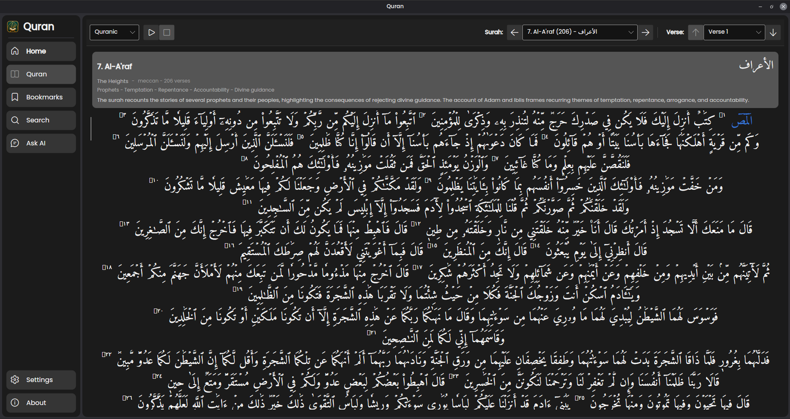
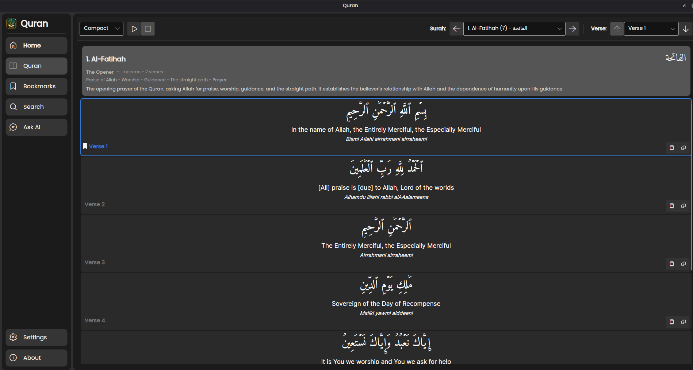
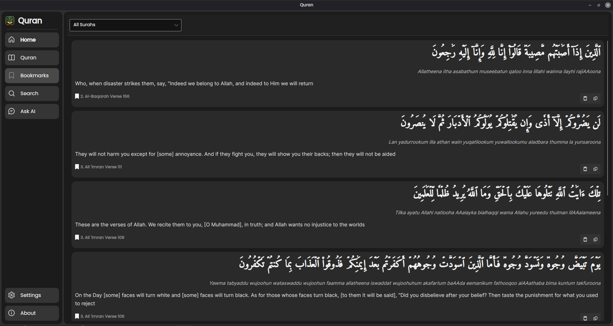
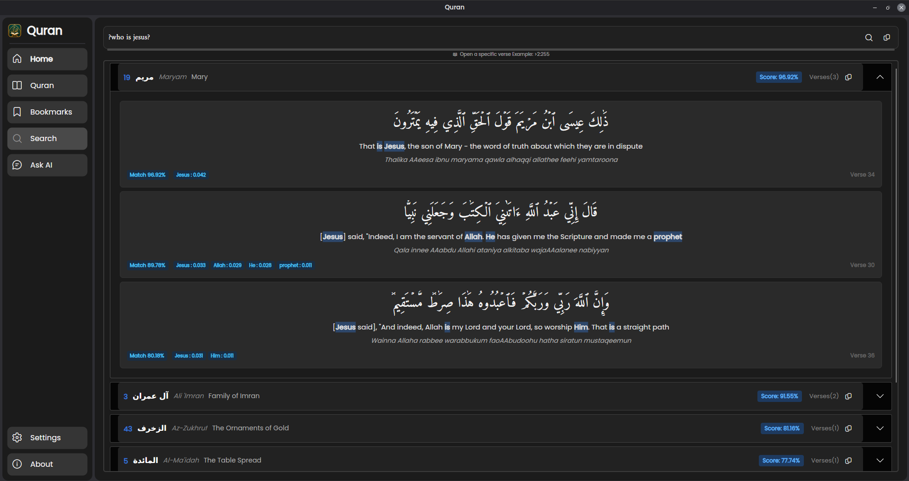
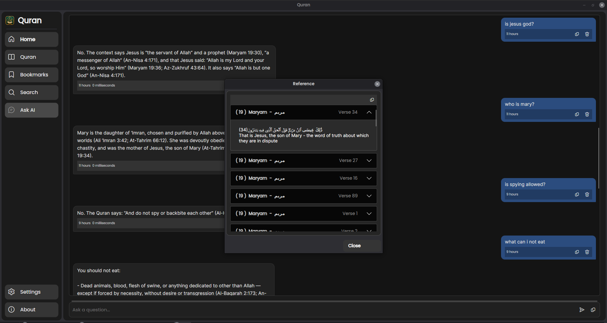

# Quran

A cross-platform desktop application for reading and studying the Quran. It brings Quranic Arabic, translations, multiple reading layouts, bookmarks, audio playback, and several ways to find verses together in one place.

## Features

- Browse surahs with Arabic names, English titles, themes, and summaries.
- Read in Quranic, compact, linear, or translation-focused layouts.
- Navigate directly to a surah or verse.
- Bookmark verses and manage them from one place.
- Play the recitation of **Mahmoud Khalil Al-Husary** while reading.
- Tafasir (exegesis) is available for each verse (in English).
- Search translations, transliterations, and Arabic text.
- Find verses with ordinary words, several words together, close spellings, or a meaning rather than an exact word.
- Use the Ask AI page to ask a question and receive a concise answer based only on the Quran verses found for that question.
- See the surah and verse references used for each Ask AI answer.
- Runs on Windows, Linux, and macOS.

## Search guide

Search is designed to be simple: type what you remember and the matching verses will be shown with the search words highlighted when they appear.

### Search tips

- Search for a word: `Jesus`
- Use several words to narrow the results: `Jesus Mary`
- Search for a surah by name: `>Baqarah:`
- Jump to a surah by number: `>114:`
- Open one verse: `>2:255`
- Open a range of verses: `>2:2-5`
- Open an entire chapter: `>112:`
- Search transliteration or Arabic directly: `>Al-Jannah` or `>الجنة`
- Try different or simpler words if you do not find what you need.

### Meaning-based search

Begin a search with `?` to look for a concept or meaning, not only an exact word:

- `? reward for good deeds`
- `? What is the night of decree?`

You can choose how many results to return by adding `:N`, for example `? mercy:5`. Meaning-based search can be written in any language supported by the search model.

### Ask AI

For a written answer rather than a list of search results, open **Ask AI** and ask a question such as `Who will go to Heaven?` Ask AI first finds relevant Quran verses, then asks the assistant to answer using only those verses. The answer is kept concise and includes the surah and verse references used as its sources.

If the available verses do not explicitly answer the question, Ask AI responds:

> I cannot answer this query based on the provided context.

Ask AI is a study aid. Always read the cited verses in their full context.

## Translation and audio credits

The application includes the following translations. The language and translator are shown in the app’s About page for transparency.

| Language | Translator |
| --- | --- |
| English | Saheeh International |
| Español | Muhammad Isa García (Muhammad Isa García) |
| বাংলা | Muhiuddin Khan (মুহিউদ্দীন খান) |
| Français | Muhammad Hamidullah |
| Bahasa Indonesia | The Sabiq company |
| Русский | Elmir Kuliev |
| Svenska | Mohammed Knut Bernström |
| Türkçe | Turkish Translation (Diyanet) |
| اردو | Syed Abul Ala Maududi |
| 中文 | 马坚 (Ma Jian) |

Audio recitation: **Mahmoud Khalil Al-Husary**.

## Screenshots

### Surah browser



### Quranic reading layout



### Compact reading layout




### Bookmarks



### Search



### Ask


Search is simple and fast. Type what you remember, and the app will show the verses that match. When a verse contains your search words, those words are highlighted so they are easier to spot.

## Build from source

Install the .NET 10 SDK, then run:

```bash
dotnet run
```

To build a self-contained release for a specific platform, replace `<runtime>` with `win-x64`, `linux-x64`, `osx-x64`, or `osx-arm64`:

```bash
dotnet publish Quran.csproj -c Release -r <runtime> --self-contained true
```

Published builds must keep the `Storage/` directory alongside the executable because it contains the local search model and its supporting files.
