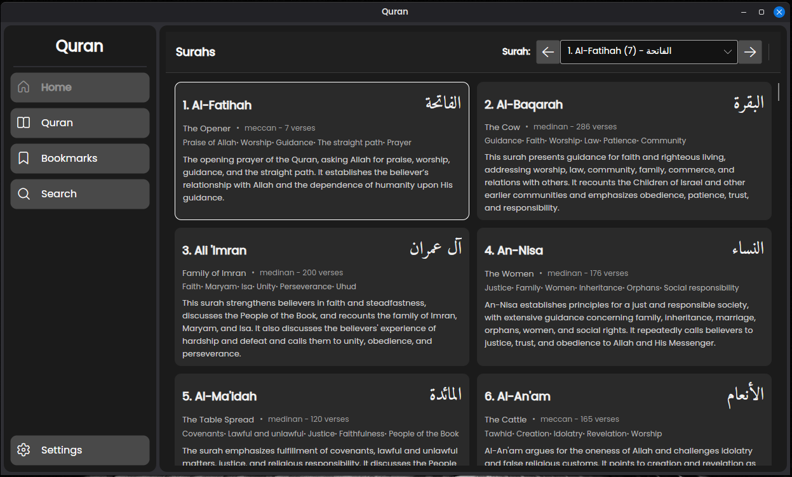
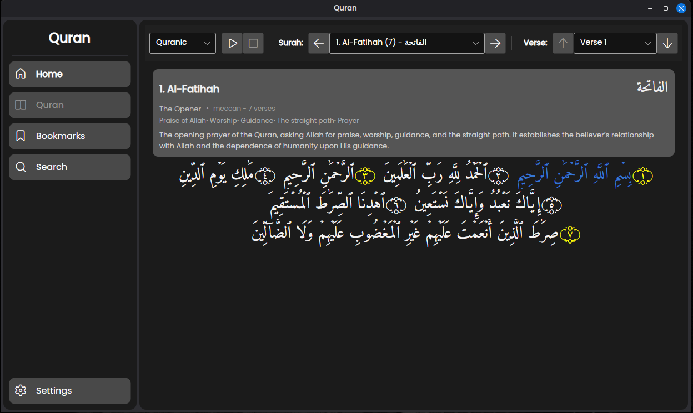
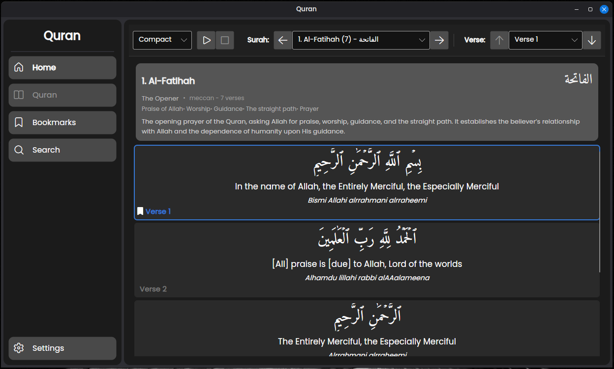
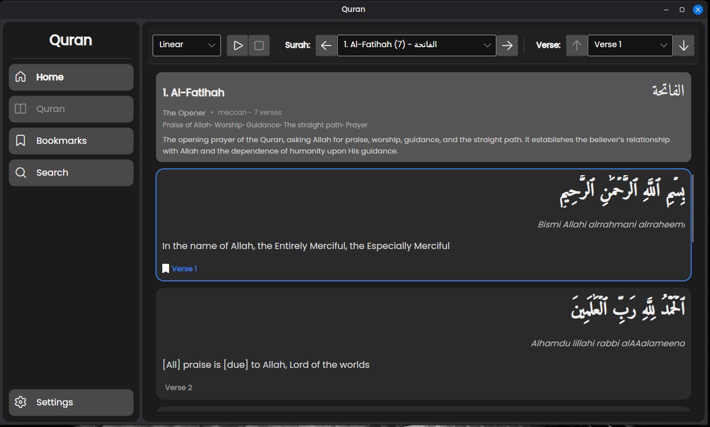
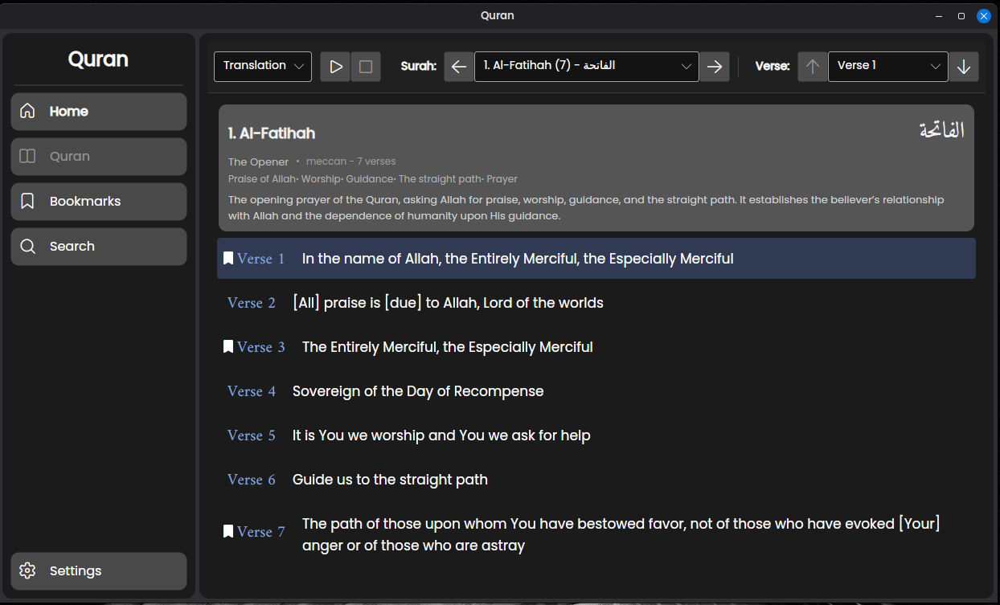
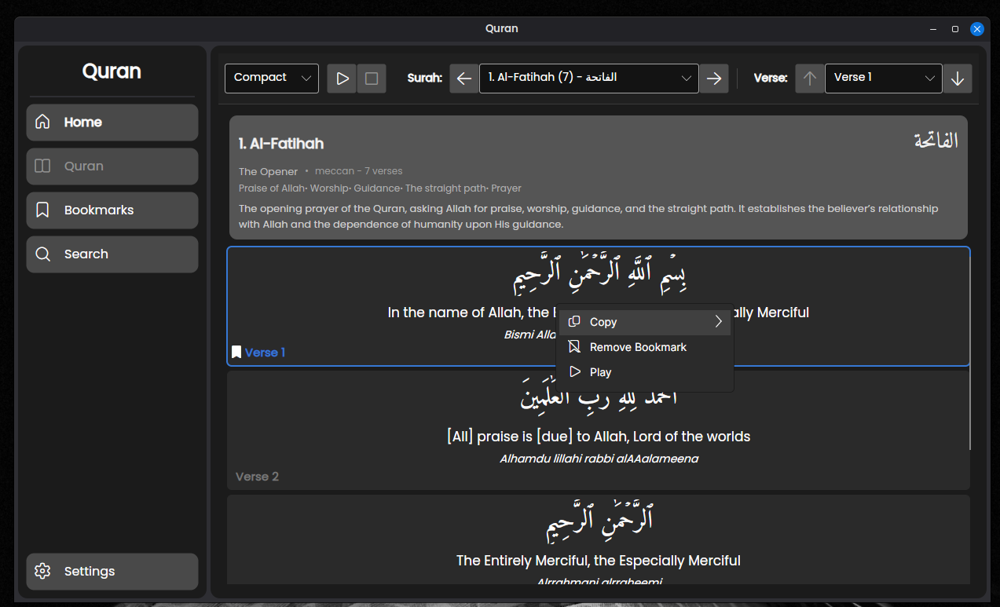
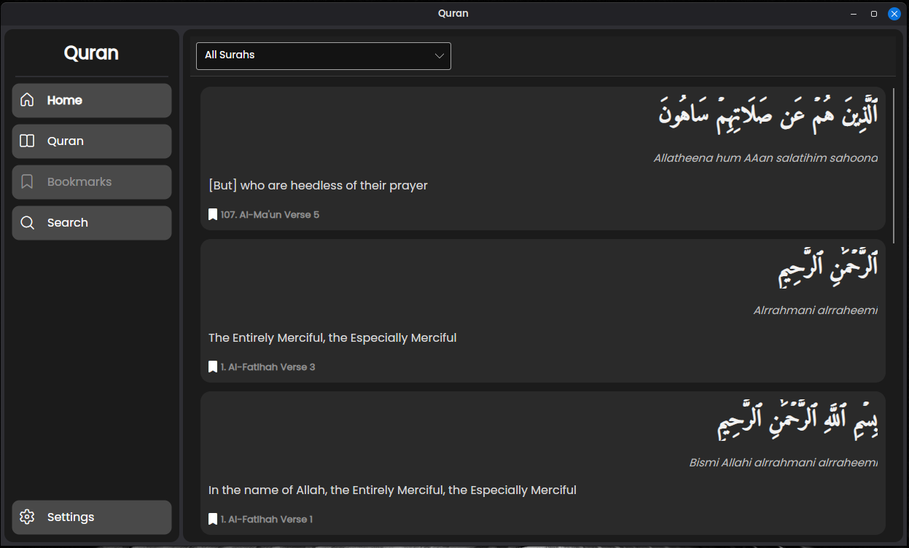
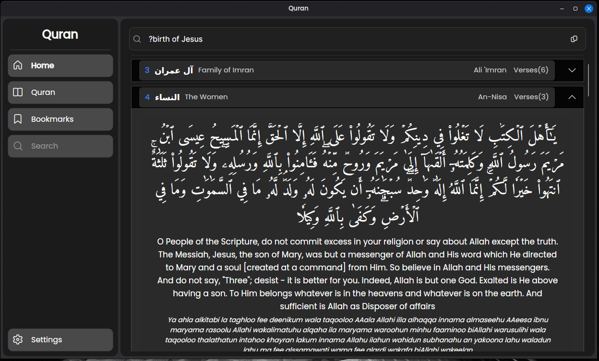

# Quran

A cross-platform desktop application for reading and studying the Quran. Built with .NET and Avalonia, it provides Quranic Arabic, translations, multiple reading layouts, bookmarks, audio playback, and search.

## Features

- Browse surahs with Arabic names, English titles, themes, and summaries.
- Read in Quranic, compact, linear, or translation-focused layouts.
- Navigate directly to a surah or verse.
- Bookmark verses and manage them from one place.
- Play recitations while reading.
- Search for words, phrases, surah names, or verse numbers, and see the matching verses right away.
- Runs on Windows, Linux, and macOS.

## Screenshots

### Surah browser



### Quranic reading layout



### Compact reading layout



### Linear reading layout



### Translation layout



### Verse menu



### Bookmarks



### Search



Search is simple and fast. Type what you remember, and the app will show the verses that match. When a verse contains your search words, those words are highlighted so they are easier to spot.

## Build from source

Install the .NET 10 SDK, then run:

```bash
dotnet run
```

To build a self-contained release for a specific platform, replace `<runtime>` with `win-x64`, `linux-x64`, `osx-x64`, or `osx-arm64`:

```bash
dotnet publish Quran.csproj -c Release -r <runtime> --self-contained true
```

Published builds must keep the `Storage/` directory alongside the executable because it contains the local search model and its supporting files.
